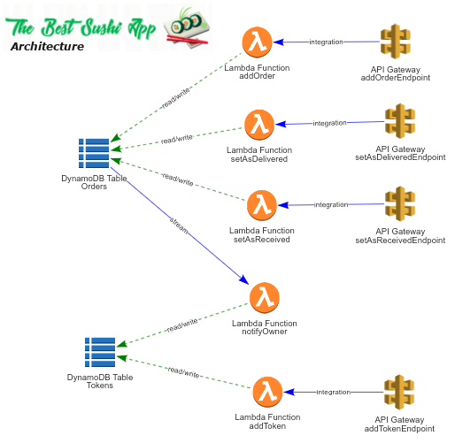
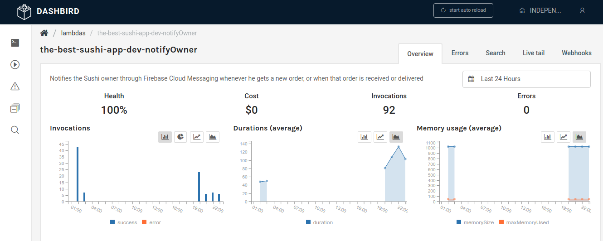
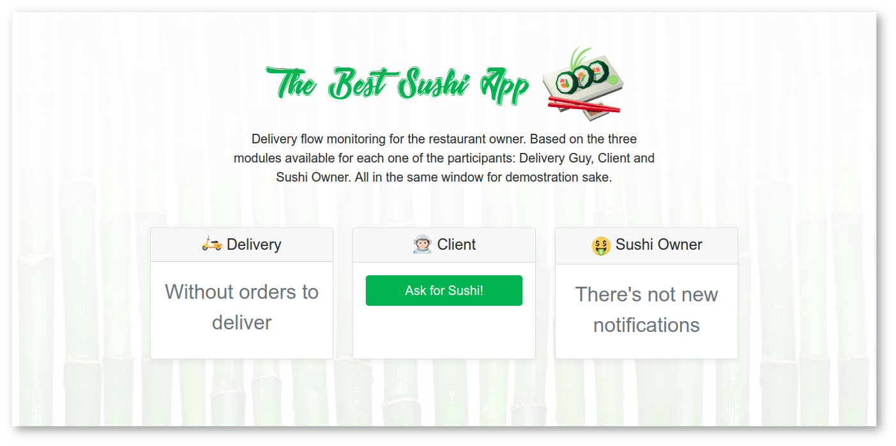
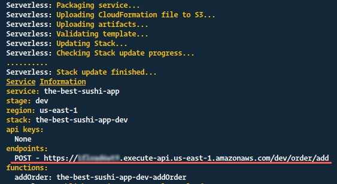
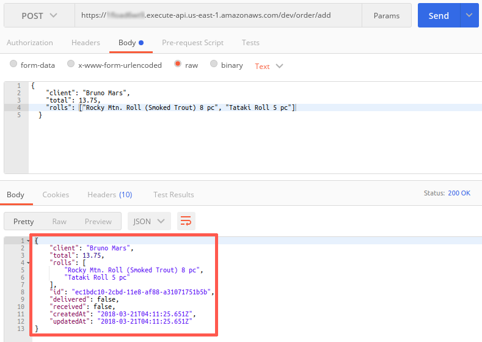
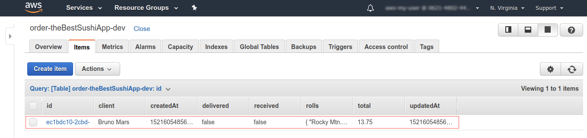
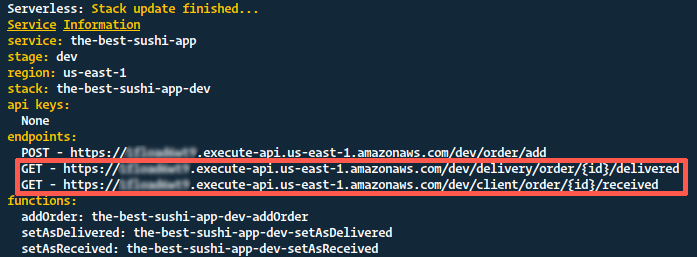
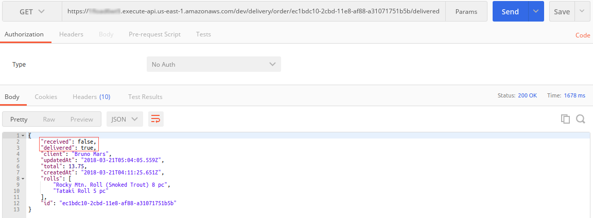

# Monitoring and Debugging a Serveless AWS Lambda Backend Sushi Delivery App without knowing about AWS

The serverless technology is becoming something as exciting and challenging as it might was deploying our first app to the internet and see it come to life, work and also crash. Maybe the latter more than we wanted at the beggining, but later when we overcame that challenge we felt like we could with everything until we aknowleged the real world production app and their architecture.

That depending in our interests, that world could maybe pushed us out of the way to focus more in our code and let that task of deploying, monitoring and giving support for apps to the Devops guys.

Well, nowadays that esoteric atmosphere of dev operation process is changing in some of its stages, because of technologies like Serverless computing for supporting the real world apps, briging again the power of creating code and functionality that can be deployed by the same developer that is writting it.



So we are here for developing together the delivery part of a Sushi Restaurant App that will have the following features...

* Creation of an order by the client.
* Push notification for the owner about the new order.
* Asynchronous updating of the order by the delivery guy.
* In same way asynchronous update by the client that it has received the order.
* The Sushi owner will received notification in real time about those updates.

Since we would be using the AWS enviroment and a lot of us developers that are reading this have __NodeJs__ background and the point here is to code and produce working apps, then i want to show you a way of making a Serverless API using AWS Lambda without the need of knowing in deep of their service but in the same way using it for production level apps. (But hey! don't forget to read about the AWS Free tier limit and prices of their services - [AWS Pricing](https://aws.amazon.com/free/))

<br>



The trick here is done with the use of [__Dashbird__](https://dashbird.io/) a platform for monitoring, debugging, notifying, alerting, performing cost analysis and more about the execution of your serverless services.

So instead of dealing with AWS Cloudwatch logging for monitoring, sns topics for alerting and ... We will just analyse our Dashbird dashboard and act when we received the alert emails for errors, imcomplete executions and more.

<br>

## Let's start building our Sushi Delivery App

Maybe you were asking... Ok! we can observe our working serverless app, but how do i deploy it to AWS?

The answer is self explanatory, well with the [__Serverless Framework__](https://serverless.com/framework/docs/providers/aws/) for using with precisely AWS Lambda functions and API Gateway. As many of you already may know this framawork is an amazing tool for creating serverless apps and considering the complexity of the task of dealing with packaging and deploying those at the beggining you will agreed that this look like dropped from heavens.

<br>

#### The Best Sushi App (Our app)



The complete app source code is available in this [repository]() and is branched in the same way that will be wrap out here...

* master (__Complete app__)
1. adding-orders
2. received-and-delivered
3. notify-owner

So for best follow up of the app building proceed to download the project form the repository with...

```bash
  $ git clone git@github.com:user/best-sushi-app.git
  $ # Then cd in our app folder
  $ cd best-sushi-app/api
  $ # Install the dependencies
  $ npm i
```

<br>

## 1. Filling the requisites

First of all we need to ensure that we have installed *__SERVER⚡LESS__* in our computer, if not then we proceed with npm...

```bash
  $ npm i -g serverless
```

Then to continue we need to configure our AWS credentials if we haven't done it before, so if that is the case, then proceed with this [Serverless guide for AWS Credentials.](https://serverless.com/framework/docs/providers/aws/cli-reference/config-credentials/)

<br>

## 2. Start coding with the order's database

For modeling and interacting with the database of the app we will be using [Dynamoose](https://github.com/automategreen/dynamoose) since the database that we would using the AWS NOSQL one DynamoDB and Dynamoose is a modeling tool for this database that has an API inspired by Mongoose, so for the one of us that are confortable creating apps with MongoDB then with Dynamoose youu will feel at home.

The job of provisioning resourses in Amazon will be done by our __serverless.yml__ configuration and we will need to declare the IAM roles for allowing the lambda functions to access the Dynamo database where we are going to store the orders.

```yml
# serverless.yml
  .
  .
  .
provider:
  name: aws
  runtime: nodejs6.10
  stage: ${opt:stage, 'dev'}
  region: us-east-1
  environment:
      ORDER_TABLE: order-theBestSushiApp-${opt:stage, self:provider.stage}

  # Is not a good practice but if you want to don't
  # care about setting puntual permissions then you
  # just set in actions and resources allowed...
  # Action:
  #   - dynamodb:*
  # Resource: "arn:aws:dynamodb:${opt:region, self:provider.region}:*:table/*"
  iamRoleStatements:
    - Effect: Allow
      Action:
        - dynamodb:DescribeTable
        - dynamodb:Query
        - dynamodb:Scan
        - dynamodb:GetItem
        - dynamodb:PutItem
        - dynamodb:UpdateItem
        - dynamodb:DeleteItem
        - dynamodb:GetRecords
        - dynamodb:GetShardIterator
        - dynamodb:DescribeStream
        - dynamodb:ListStreams
      Resource: "arn:aws:dynamodb:${opt:region, self:provider.region}:*:table/${self:provider.environment.ORDER_TABLE}"

functions:
  .
  .
  .
resources:
  Resources:
    orderTable:
      Type: 'AWS::DynamoDB::Table'
      DeletionPolicy: Retain
      Properties:
        TableName: ${self:provider.environment.ORDER_TABLE}
        AttributeDefinitions:
          -
            AttributeName: id
            AttributeType: S
        KeySchema:
          -
            AttributeName: id
            KeyType: HASH
        ProvisionedThroughput:
          ReadCapacityUnits: 1
          WriteCapacityUnits: 1
        # Stream enabling order status notification
        StreamSpecification:
          StreamViewType: NEW_IMAGE

```

<br>

In this way just got configured the order database for start using with the app (Enable streams only if you need them). In the models folder we define the order's model for creating new ones.

```javascript
// api/models/order.js
const orderSchema = new Schema({
  id: {
    type: String,
    hashKey: true
  },
  rolls: [String],
  client: String,
  total: Number,
  delivered: {
    type: Boolean,
    default: false
  },
  received: {
    type: Boolean,
    default: false
  }
}, {
  timestamps: true
})

module.exports.Order = dynamoose.model(process.env.ORDER_TABLE, orderSchema)
```

<br>

Then in the folder handlers we continue with the creation of the service for adding new orders to the database of the Sushi App, in the file `add.js` following the [signature of an AWS Lambda function](https://docs.aws.amazon.com/lambda/latest/dg/nodejs-prog-model-handler.html)...

```javascript
// api/handlers/add.js
module.exports.addOrder = (event, context, callback) => {
  // *** Error handling support in promises
  const handleErr = (errData) => {
    const errResponse = pe(errData)
    console.log(' => EVENT:', event)
    console.log(' => BODY:', body)
    callback(errResponse.stack, null)
  }

  const { body } = event

  createOrder(body)
    .then(newOrder => {
      const response = {
        statusCode: 200,
        headers: {
          'Content-Type': 'application/json',
          'Access-Control-Allow-Origin': '*'
        },
        body: JSON.stringify(newOrder)
      }

      console.log(` => Order [${newOrder.id}] created`)
      callback(null, response)
    })
    .catch(handleErr)
}

const createOrder = data => {
  let orderData = JSON.parse(data)
  orderData.id = uuid()

  return Order.create(orderData)
}
```

The function `createOrder` have been defined outside the handler `addOrder` itself to mantain only the IO task in it, since this improves the cold start time spam. Considere that the maximun Node runtime that can be set for Lambda functions is v6.10, so if you want to use `Object static methods, object rest/spread, async/await` or any other ES6+ suggar you need to enabled through Babel transpilling and this app project is ready to received through webpack loader, but the configuration of configuration of it for production level results is out of the scope of this article (maybe the next time😊).

<br>

## 3. Deploying and testing the add order service endpoint

Having the handler developed we need to define it in the `serverless.yml` file in the functions list...

```yml
# serverless.yml
  .
  .
  .

  functions:
    addOrder:
      description: Adds a new order
      handler: handlers/add.addOrder
      events:
        # http events declarations informs Serverless
        # to provision API Gateway Lambda proxy integration
        # for this function to be accesible throuhg the
        # defined path and http verb
        - http:
            path: order/add
            method: post
            cors: true
  .
  .
  .
```

Here we got Serverless doing for us the work of configuring nd provision the Lambda function packaging and uploading, also and very important setting the AWS Api Gateway proxy integration for allowing access through the endpoint path defined (here "order/add") and with the `POST` method for receiving the order data.

<br>

#### Let's deploy 🚀

In the terminal located in the folder of the project where we got the `serverless.yml` file we enter...

```bash
  $ serverless deploy
```
As a result for the deploy we got this result...



Which means that we are going in good way, now let's give the endpoint a try and add a new order to the database. For this i will be using [Postman](https://www.getpostman.com/)...



<br>

#### Yeah!! 👏 All is working good.

Now if we go to our AWS console and from there to our DynamoDB tables view we will have our first entry to the table...



<br>

So up to this point all the proccess is complete the data is being stored and we can go further we the rest of the app functionality.

<br>

## 4. Endpoints for updating as delivred and received

The functionality relative to the delivery guy and the client of updating the order as delivered and received respectively will be done by 2 services invoked by its endpoints, so now you can change the project to the branch `received-and-delivered` for the follow up of those simple services.

We'll proceed to declare them in the serverless.yml file...

```yml
# serverless.yml
  .
  .
  .

functions:
  addOrder:
    ...

  setAsDelivered:
    description: Updates an order as delivered
    handler: handlers/delivered.setAsDelivered
    events:
      - http:
          path: delivery/order/{id}/delivered
          method: get
          cors: true

  setAsReceived:
    description: Updates an order as received
    handler: handlers/received.setAsReceived
    events:
      - http:
          path: client/order/{id}/received
          method: get
          cors: true
  .
  .
  .
```

These services will only update the status of the order we will be ordering to do it through `GET` with the __id__ of the order, but since we are receiving the id as a parameter in the url, the code of the handlers for these services is a bit diferent from the `addOrder.js` but at the same time very straighforward...

```javascript
// delivered.js
module.exports.setAsDelivered = (event, context, callback) => {
  // *** Error handling support in promises
  const handleErr = (errData) => {
    const errResponse = pe(errData)
    console.log(' => EVENT:', event)
    console.log(' => BODY:', body)
    callback(errResponse.stack, null)
  }

  // Here we get the id from the url
  const { pathParameters: { id } } = event

  Order.update({ id, delivered: true })
    .then(deliveredOrder => {
      const response = {
        statusCode: 200,
        headers: {
          'Content-Type': 'application/json',
          'Access-Control-Allow-Origin': '*'
        },
        body: JSON.stringify(deliveredOrder)
      }

      console.log(` => Order [${deliveredOrder.id}] set as delivered`)
      callback(null, response)
    })
    .catch(handleErr)
}
```

Now that we have two more services we will deploy them like before with...

```bash
  $ serverless deploy
```

<br>

As a result we will now have the endpoints for the two just deployed services...



<br>

#### Now for testing result with Postman



