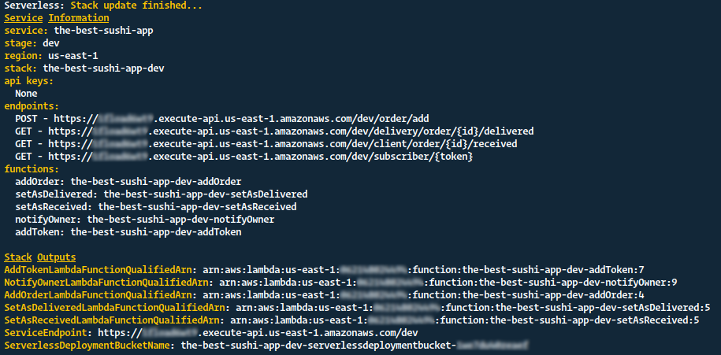
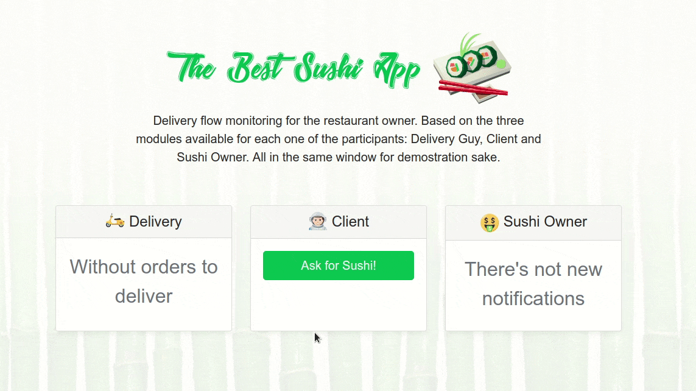

[](http://www.serverless.com)
# AWS Lambda backed Sushi Delivery App (demo)

This repository contains the code for the demostrations and following of the article [Monitoring and Debugging an AWS Lambda Backed Sushi Delivery App without knowing about AWS](https://dashbird.io/blog/monitoring-debugging-lambda-app-without-knowing-of-aws/).

<br>

#### Structure of demo code...

```bash
# This repository
  ├── Article
  │   ├── assets
  │   └── content.md # Main article of the repository
  └── the-best-sushi-app
      ├── api
      └── client
```
<br>

## Instructions to start the API...

```bash
  $ npm i -g serverless
```

Proceed to [configure your AWS credentials](https://serverless.com/framework/docs/providers/aws/cli-reference/config-credentials/). Then...

```bash
  $ cd the-best-sushi-app/api
  $ npm i
  # deploy the backend api endpoints to AWS with...
  $ serverless deploy -v
```

<br>

#### You might expect to get a result like this one...



<br>

## Instructions to start the Client...

First of all you will need to create a [Firebase account](https://firebase.google.com/) it's a peace of cake! And for start it is virtually free to use.

Then, copy the file `.env.example` a rename to `.env` updating all the variables inside it with your firebase configuration keys and with your previously generated backend JSON API base url, after that you can proceed to install dependencies and start the app, as follow...

```bash
  $ cd the-best-sushi-app/client
  $ yarn
  $ yarn start
```

<br>

#### You might expect to see in action The Best Sushi App 🍣




Don't forget to read the complete [article](https://dashbird.io/blog/monitoring-debugging-lambda-app-without-knowing-of-aws/) 😉